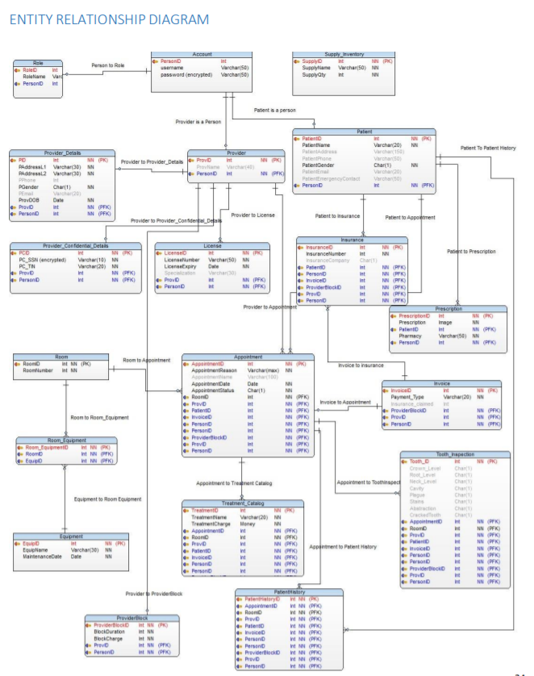

# Dmdd--Dentist-Clinic-Database-
Dmdd project 2019

# ER Diagram

# INTRODUCTION

This document is being written in context with the business requirements of the dental office database
management system. We are creating a system to support the scheduling, treatment and billing of patients at a
dental office. The database management system will help the dental office to keep track of the necessary details
of all patients and dentists. It is also designed to track each and every transaction related to the appointments.
The system also looks towards the different specializations of a dentist and helps patients choose a dentist
according to their requirement. The database also stores the patient’s history details, if any, which can help the
dentist in giving proper treatment to the patient.

This system looks towards the different specializations of a dentist and helps patients choose a dentist
according to their requirement. The patient can book appointments with the dentists for preferred date and time.
We enforce that the patient can only book one appointment at any specific time. The database saves various
appointment details like date and time, location, and status of the appointment. We will also have patient history
where all the appointments of the patient will be saved for future references. This will help dentists to give
appropriate treatment to the patients. There will be a treatment catalog which will track all the treatments. The
appointments may contain one or more treatments. The invoice generated will be the summation of charges
applied for all the treatments done in that scheduled appointment. Thus, we will have all the references to the
appointment entity in this system. There will be a database table for prescription as well which will be holding all
the prescription details provided to the patient in an appointment.

The system also allows the patients to claim their insurance, although from a limited insurance companies
which the office supports. The system accepts payments in cash, check, card and insurance claims. It allows
the office to track the status of claims and work in an orderly fashion to acquire the amount from insurance
companies. The system also supports some functionalities which might be added as the model grows. Such as,
the system can also be designed to store all the location details of the dental office in case it operates at multiple
locations. Also, the system can help to generate timely notifications for equipment maintenance, cleanliness and
giving pay outs to its employees if the business requires it.

This system will provide an organized solution for the dental office and help it function in a well-structured
way. This system takes into consideration all the aspects related to the appointment of a patient with a dentist.
However, this system fails to consider any other entities which is not related either directly or indirectly to the
patient’s treatment. The employee details like the assistants, nurses and their salary payments are not to be
taken into consideration. The list of supplies and equipment used at the office is also not taken care of yet.
However, this system still takes enough rules and entities into consideration so that it can deliver a sufficient
amount of experience to a patient. Hence, this system provides a prodigious solution to the dental office for its
successful operation and providing satisfactory treatment to people visiting the dental office.
